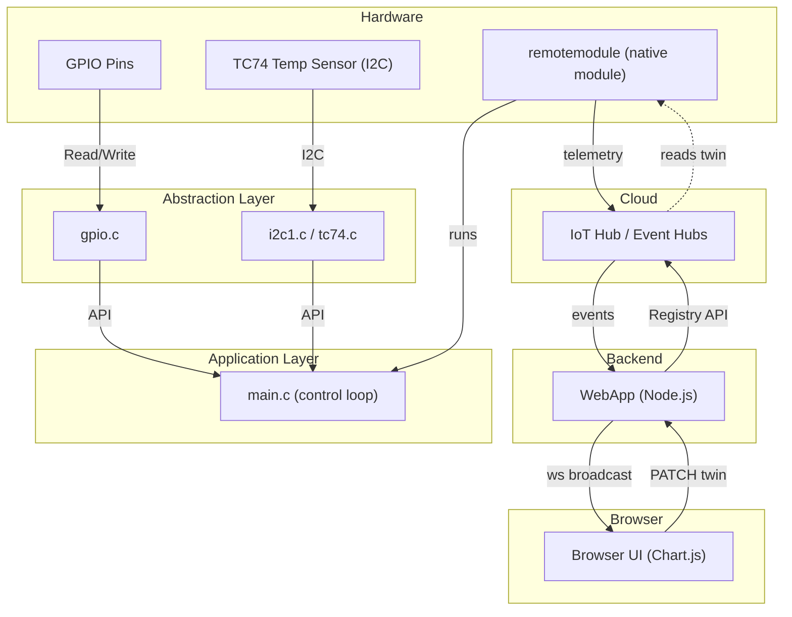
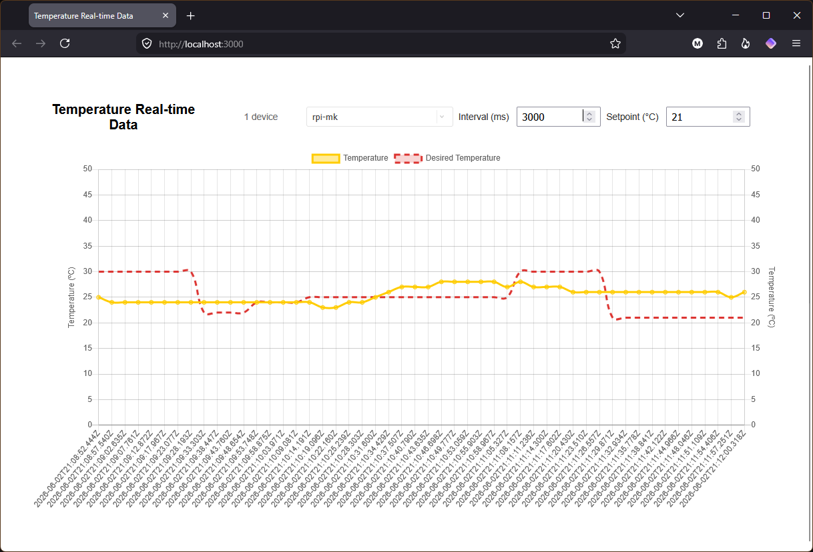

# Raspberry Pi IoT Edge

Lightweight IoT Edge solution for Raspberry Pi combining a native edge module (TC74 I2C sensor + GPIO control) and a Node.js WebApp for telemetry visualization and twin-based control.

---

## Features

- Native IoT Edge module (`remotemodule`) reading TC74 I2C temperature and controlling HEAT / COOL outputs.
- Twin-driven control: `desired_temperature` and `telemetry_interval_ms` (0 = disable periodic telemetry).
- Telemetry pipeline: module → IoT Hub / Event Hubs → WebApp backend → WebSocket → browser UI (Chart.js).
- Web UI to view telemetry and edit desired twin properties.
- Deploy helper: `IotEdge/deploy.ps1` automates build / push / deploy for Windows workflows.

---

## Technologies

- **PJ's GPIO Library**: Low-level GPIO access for Raspberry Pi.
- **I2C (TC74)**: Reads temperature from a Microchip TC74 sensor.
- **Node.js + Express**: WebApp backend.
- **Chart.js**: Frontend realtime charting (in `WebApp/public/`).
- **CMake / Docker**: Build native module and images for multiple architectures.
- **pinctrl**: CLI tool for configuring and reading GPIO pin states.

---

## Architecture



## WebApp UI



---

## Configuration

How to provide runtime configuration: env files, environment variables, and secret stores.

Set Windows environment variables (PowerShell) — required for local WebApp startup (`npm start`) on Windows
```powershell
# Set the variables the WebApp expects
setx IotHubConnectionString "<YOUR_IOTHUB_CONNECTION_STRING>"
setx EventHubConsumerGroup "webapp"
setx ModuleId "remotemodule"
```
Restart Visual Studio Code to apply the environment variable changes.

Note: The WebApp reads `IotHubConnectionString` (as required by `WebApp/server.js`). The workspace `.env-template` uses `IOTHUB_CONNECTION_STRING` for deploy helpers; set that in your `.env` file when using the `IotEdge` tooling.

### Environment file

A sanitized template is provided at `IotEdge/workspace/iotedge-solution/.env-template`. Copy it to `.env`, edit the file to set your registry, tag and any credentials required for pushing images, and do not commit `.env` to source control.

```powershell
cd IotEdge\workspace\iotedge-solution
Copy-Item .env-template .env
notepad .env   # edit and save (fill registry, tag, credentials as needed)
```

See `IotEdge/workspace/iotedge-solution/.env-template` for the full list of configurable variables used by the workspace tooling.

Keep secrets (connection strings, passwords) out of source control; use local `.env` files or CI secret storage for credentials.

Important variables you should set in your local `.env` (from `.env-template`):

- `IOTHUB_CONNECTION_STRING` — IoT Hub connection string used by helpers.
- `DEVICE_CONNECTION_STRING` — device connection string for device-scoped helpers.
- `CONTAINER_REGISTRY_SERVER` — container registry host (e.g. myregistry.azurecr.io).
- `CONTAINER_REGISTRY_USERNAME` — registry username (if required).
- `CONTAINER_REGISTRY_PASSWORD` — registry password (if required).

---

## Quick Setup

### 1) System prerequisites
- Docker & a container registry (for image builds & device pulls)
- Node.js (v14+) and npm
- Azure IoT Hub with permissions to read/update module twins and read events

### 2) Run the WebApp (local development)
```bash
cd WebApp
npm install
npm start
```
- The UI is served from `WebApp/public/`. Backend reads events and broadcasts telemetry via WebSocket.

### 3) Deploy IoT Edge solution (Windows PowerShell helper)
```powershell
cd IotEdge
.\deploy.ps1
```
- [IotEdge/deploy.ps1](IotEdge/deploy.ps1) uses repository defaults: it generates a timestamped tag, updates the module's `module.json`, then builds, pushes and deploys the solution via the included docker-compose/iotedgedev flow. For CI or custom behavior you can pass arguments or edit the script.

---

## Build the Native Module (example)

Local native build:
```bash
cd IotEdge/workspace/iotedge-solution/modules/remotemodule
mkdir -p build && cd build
cmake ..
make
```
- Dockerfiles for `amd64`, `arm32v7`, and `arm64v8` are included in the module folder for cross-arch image builds.

---

## Usage

### GPIO Pinout (HEAT / COOL)
- `GPIO 17` — HEAT output (symbol `GPIO_HEAT` in `remotemodule` source).
- `GPIO 19` — COOL output (symbol `GPIO_COOL` in `remotemodule` source).
- `GPIO 26` — auxiliary input.
- `GPIO 27` — auxiliary input.

The module reads the TC74 temperature and:
- enables HEAT (`GPIO17`) when temperature < `desired_temperature`,
- enables COOL (`GPIO19`) when temperature > `desired_temperature`,
- otherwise turns both outputs off.

(See `IotEdge/workspace/iotedge-solution/modules/remotemodule/main.c` for the exact constants and control logic.)

### Check GPIO pin states (HEAT/COOL verification)

Example output showing HEAT/COOL pin states (run on the Pi to inspect pins 17,27,19,26):

```bash
pi@rpi-mk:~ $ pinctrl get 17,27,19,26
17: op -- pd | lo // GPIO17 = output
19: op -- pd | hi // GPIO19 = output
26: ip    pd | hi // GPIO26 = input
27: ip    pd | lo // GPIO27 = input
```

Here the COOL output (GPIO19) is active (hi) and HEAT (GPIO17) is inactive (lo).

- Format: `GPIO#: <mode> <pull> | <level>`
- Watch `GPIO17` and `GPIO19` to verify heater/cooler outputs toggle as the module changes mode.

---

## Running the Application

- Start WebApp locally:
```bash
cd WebApp
npm install
npm start
```

- Deploy module to IoT Edge device:
- Use `IotEdge/deploy.ps1` (Windows) or adapt your CI to build/push images and update `deployment.template.json`.
- Confirm the module is deployed and connected in Azure Portal or with `az iot` CLI.

---

## WebApp API (useful endpoints)

- `GET /api/module-settings?deviceId=<id>`
Returns confirmed twin desired properties: `{ deviceId, desiredTemperature, telemetryIntervalMs }`.

- `POST /api/desired-temperature`
Body: `{ "deviceId": "<id>", "value": 24 }` → patches `properties.desired.desired_temperature`.

- `POST /api/telemetry-interval`
Body: `{ "deviceId": "<id>", "value": 5000 }` → patches `properties.desired.telemetry_interval_ms`.

WebSocket broadcasts use a payload like:
```json
{
"IotData": 22.5,
"MessageDate": "2026-06-02T12:34:56Z",
"DeviceId": "rpi1",
"DesiredTemperature": 24,
"TelemetryIntervalMs": 5000
}
```

---

## Troubleshooting

- Check module status on the device:
    - Run `sudo iotedge list` on the edge device to see module names and statuses (running/restarting/failed).

- No telemetry in UI:
    - Verify Event Hubs reader can connect (check `WebApp` logs).
    - Confirm telemetry reaches IoT Hub / Event Hubs.

 - Twin updates not applied:
    - Verify `IotHubConnectionString` and permissions. Inspect twin with Azure Portal or:
        ```bash
        az iot hub module-twin show --hub-name <HubName> --device-id <deviceId> --module-id remotemodule
        ```

- Module not reacting to twin:
    - Confirm `remotemodule` subscribes to module twin updates and parses `properties.desired` fields.

---

## Development Notes

- Frontend assets: `WebApp/public/` (`index.html`, `js/chart-device-data.js`, `css/style.css`).
- Backend: `WebApp/server.js` contains API routes and event reader logic.
- Native module: `IotEdge/workspace/iotedge-solution/modules/remotemodule/` (C sources, Dockerfiles, `module.json`).

---
